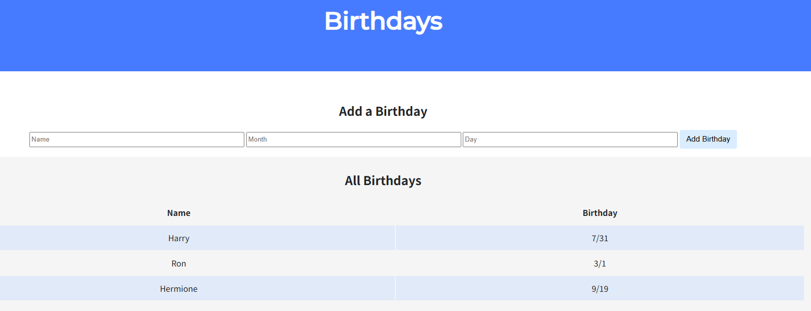
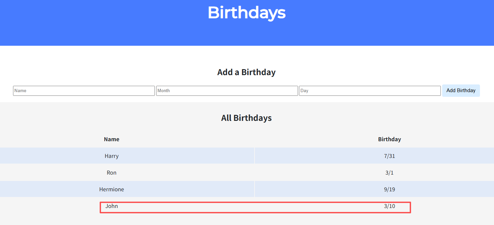
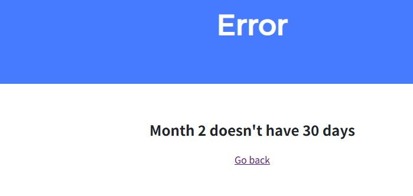
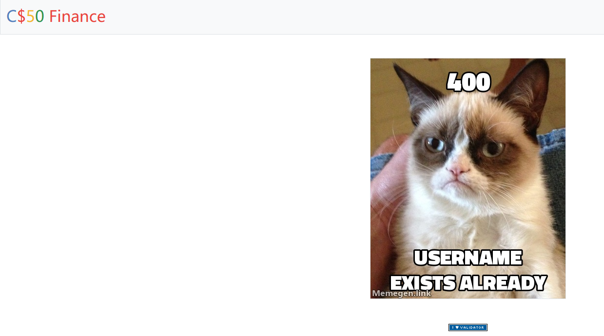
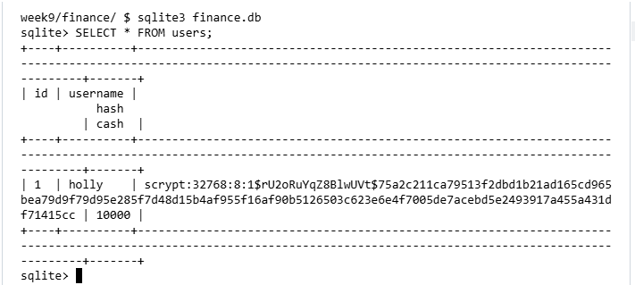
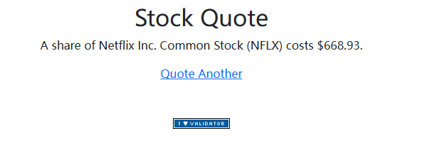
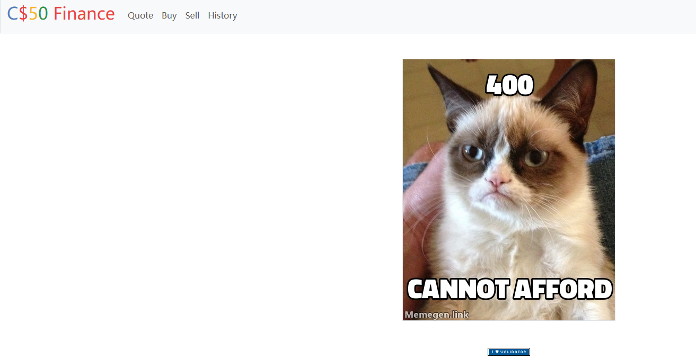
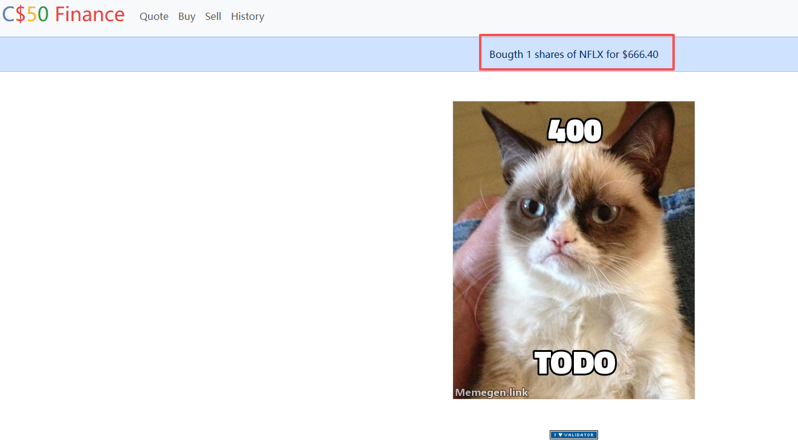

# Week 9 Problem Set 概述

本周的作业让我们将所学的 Flask 知识应用到实际项目中，包含两个项目：

| 项目 | 难度 | 核心技术 |
|------|------|---------|
| **Birthdays** | ⭐⭐ | Flask 基础、表单处理、SQL CRUD |
| **Finance** | ⭐⭐⭐⭐⭐ | 完整 Web 应用、Session、API 调用、数据库设计 |

> 📚 **前置知识回顾**：[Week 9 Flask 课程笔记](/cs50/2025-01-08-cs50-week-9-flask/)

---

# 1. Birthdays（生日记录应用）

实现一个 Web 应用，用于记录朋友的生日。


## 项目结构

```bash
birthdays/
├── app.py              # Flask 应用主程序
├── birthdays.db        # SQLite 数据库
├── static/
│   └── styles.css      # 样式文件
└── templates/
    └── index.html      # 主页模板
```

## 数据库结构

```sql
sqlite3 birthdays.db
sqlite> .schema
CREATE TABLE birthdays (
    id INTEGER,
    name TEXT,
    month INTEGER,
    day INTEGER,
    PRIMARY KEY(id)
);
```

## 任务分析

课程已提供代码框架，我们需要完成：

| 请求类型 | 任务描述 |
|---------|---------|
| **GET `/`** | 从数据库查询所有生日，以表格形式显示 |
| **POST `/`** | 接收表单数据，添加新生日到数据库 |

**可选任务**：
- 添加删除/编辑生日条目的功能
- 添加任何你想添加的功能

---

## 分步实现

### Step 1: 创建表单（前端）

首先，我们需要在 `index.html` 中创建一个表单，让用户输入生日信息：

```html
<form action="/" method="post">
    <input name="name" placeholder="Name" type="text" required>
    <input name="month" placeholder="Month" type="number" min="1" max="12" required>
    <input name="day" placeholder="Day" type="number" min="1" max="31" required>
    <input type="submit" value="Add Birthday">
</form>
```

**表单属性说明**：

| 属性 | 说明 |
|------|------|
| `action="/"` | 表单提交到根路由 |
| `method="post"` | 使用 POST 方法提交 |
| `min`/`max` | 客户端验证，限制输入范围 |
| `required` | 必填字段 |

### Step 2: 处理 POST 请求（后端）

在 `app.py` 中处理用户提交的数据：

```python
if request.method == "POST":
    # 1. 获取表单数据
    name = request.form.get("name")
    month = request.form.get("month")
    day = request.form.get("day")
    
    # 2. 插入数据库
    db.execute("INSERT INTO birthdays (name, month, day) VALUES(?, ?, ?)", 
               name, month, day)
    
    # 3. 重定向到首页
    return redirect("/")
```

### Step 3: 处理 GET 请求（后端）

查询所有生日并传递给模板：

```python
else:  # GET 请求
    # 查询所有生日
    birthdays = db.execute("SELECT * FROM birthdays")
    return render_template("index.html", birthdays=birthdays)
```

### Step 4: 显示生日列表（前端）

在 `index.html` 中使用 Jinja2 遍历并显示生日：

```html
<tbody>
    
        <tr>
            <td>{{ birthday.name }}</td>
            <td>{{ birthday.month }}/{{ birthday.day }}</td>
        </tr>
    
</tbody>
```

---

## 完整代码（带数据验证）

### app.py

```python
import os
from cs50 import SQL
from flask import Flask, redirect, render_template, request

# 配置应用
app = Flask(__name__)

# 确保模板自动重载
app.config["TEMPLATES_AUTO_RELOAD"] = True

# 配置数据库
db = SQL("sqlite:///birthdays.db")


@app.after_request
def after_request(response):
    """禁用缓存"""
    response.headers["Cache-Control"] = "no-cache, no-store, must-revalidate"
    response.headers["Expires"] = 0
    response.headers["Pragma"] = "no-cache"
    return response


@app.route("/", methods=["GET", "POST"])
def index():
    if request.method == "POST":
        # 获取表单数据
        name = request.form.get("name")
        month = request.form.get("month")
        day = request.form.get("day")
        
        # ===== 数据验证 =====
        # 验证 name 不为空
        if not name or not name.strip():
            return render_template("error.html", message="Name cannot be empty")
        
        # 验证 month 和 day 存在
        if not month or not day:
            return render_template("error.html", message="Month and day are required")
        
        # 转换为整数并验证
        try:
            month = int(month)
            day = int(day)
        except ValueError:
            return render_template("error.html", message="Month and day must be numbers")
        
        # 验证范围
        if month < 1 or month > 12:
            return render_template("error.html", message="Month must be between 1 and 12")
        
        # 更严格的日期验证
        days_in_month = {
            1: 31, 2: 29, 3: 31, 4: 30, 5: 31, 6: 30,
            7: 31, 8: 31, 9: 30, 10: 31, 11: 30, 12: 31
        }
        if day < 1 or day > days_in_month[month]:
            return render_template("error.html", 
                                   message=f"Month {month} doesn't have {day} days")
        
        # 清理数据并插入数据库
        name = name.strip()
        db.execute("INSERT INTO birthdays (name, month, day) VALUES (?, ?, ?)", 
                   name, month, day)
        
        return redirect("/")
    
    else:  # GET 请求
        birthdays = db.execute("SELECT * FROM birthdays")
        return render_template("index.html", birthdays=birthdays)
```

### templates/error.html

```html
<!DOCTYPE html>
<html lang="en">
    <head>
        <link href="https://fonts.googleapis.com/css2?family=Montserrat:wght@500&display=swap" rel="stylesheet">
        <link href="/static/styles.css" rel="stylesheet">
        <title>Error</title>
    </head>
    <body>
        <div class="header">
            <h1>Error</h1>
        </div>
        <div class="container">
            <div class="section">
                <h2>{{ message }}</h2>
                <p><a href="/">Go back</a></p>
            </div>
        </div>
    </body>
</html>
```

---

## 测试演示

### 1. 查看初始数据

运行 `flask run`，浏览器打开页面：



查询数据库确认有三条数据：

```sql
SELECT * FROM birthdays;
```

### 2. 添加新生日



验证数据库：

```sql
SELECT * FROM birthdays WHERE name = 'John';
+----+------+-------+-----+
| id | name | month | day |
+----+------+-------+-----+
| 4  | John | 3     | 10  |
+----+------+-------+-----+
```

### 3. 测试错误处理

输入非法数据时，显示错误提示：



---

# 2. Finance（股票交易模拟平台）

实现一个网站，用户可以通过该网站"购买"和"出售"股票。


## 项目背景

如果你不太清楚买卖股票是什么意思，可以参考 [Investopedia 教程](https://www.investopedia.com/articles/basics/06/invest1000.asp)。

这是本周最复杂的项目，涵盖了 Web 开发的核心技能：
- 用户认证（注册/登录）
- 数据库设计与操作
- API 调用
- Session 管理
- 表单验证

## 项目结构

```bash
finance/
├── app.py              # Flask 应用主程序
├── finance.db          # SQLite 数据库
├── helpers.py          # 辅助函数
├── requirements.txt    # 依赖列表
├── static/
│   ├── favicon.ico
│   ├── I_heart_validator.png
│   └── styles.css
└── templates/
    ├── apology.html    # 错误页面
    ├── layout.html     # 布局模板
    └── login.html      # 登录页面
```

## 现有数据库结构

```sql
sqlite3 finance.db
sqlite> .schema
CREATE TABLE users (
    id INTEGER PRIMARY KEY AUTOINCREMENT NOT NULL, 
    username TEXT NOT NULL, 
    hash TEXT NOT NULL, 
    cash NUMERIC NOT NULL DEFAULT 10000.00
);
CREATE UNIQUE INDEX username ON users (username);
```

**注意**：每个新用户默认拥有 $10,000 现金！

---

## 一、理解现有架构

在写代码之前，先理解项目提供的文件：

### app.py 中已实现的功能

| 路由 | 状态 | 说明 |
|------|------|------|
| `/login` | ✅ 已实现 | 用户登录 |
| `/logout` | ✅ 已实现 | 用户登出 |
| `/register` | ❌ 待实现 | 用户注册 |
| `/quote` | ❌ 待实现 | 查询股票价格 |
| `/buy` | ❌ 待实现 | 买入股票 |
| `/sell` | ❌ 待实现 | 卖出股票 |
| `/` | ❌ 待实现 | 首页/投资组合 |
| `/history` | ❌ 待实现 | 交易历史 |

### helpers.py 提供的函数

```python
def apology(message, code=400):
    """渲染错误页面"""
    # 用于显示错误信息给用户

def login_required(f):
    """装饰器：要求用户登录"""
    # 保护需要登录才能访问的路由

def lookup(symbol):
    """查询股票价格"""
    # 输入: "AAPL" (股票代码)
    # 输出: {"name": "Apple Inc.", "price": 150.25, "symbol": "AAPL"}
    # 如果找不到返回 None

def usd(value):
    """格式化为美元"""
    # 输入: 1234.56
    # 输出: "$1,234.56"
```

---

## 二、设计数据库

现有的 `users` 表只能存储用户信息，我们需要一张新表来记录交易。

### 创建 transactions 表

```sql
CREATE TABLE transactions (
    id INTEGER PRIMARY KEY AUTOINCREMENT,
    user_id INTEGER NOT NULL,
    symbol TEXT NOT NULL,
    shares INTEGER NOT NULL,
    price NUMERIC NOT NULL,
    transacted_timestamp DATETIME DEFAULT CURRENT_TIMESTAMP,
    FOREIGN KEY(user_id) REFERENCES users(id)
);
```

**字段说明**：

| 字段 | 类型 | 说明 |
|------|------|------|
| `id` | INTEGER | 交易记录唯一编号 |
| `user_id` | INTEGER | 关联 users 表 |
| `symbol` | TEXT | 股票代码（如 AAPL） |
| `shares` | INTEGER | 股数（**买入为正，卖出为负**） |
| `price` | NUMERIC | 成交单价 |
| `transacted_timestamp` | DATETIME | 交易时间 |

### 创建索引（提高查询速度）

```sql
CREATE INDEX idx_user_transactions ON transactions(user_id);
CREATE INDEX idx_user_symbol ON transactions(user_id, symbol);
```

---

## 三、实现注册功能（register）

### 前端：templates/register.html

```html



    Register



    <form action="/register" method="post">
        <div class="mb-3">
            <input autocomplete="off" autofocus class="form-control mx-auto w-auto" 
                   name="username" placeholder="Username" type="text" required>
        </div>
        <div class="mb-3">
            <input class="form-control mx-auto w-auto" 
                   name="password" placeholder="Password" type="password" required>
        </div>
        <div class="mb-3">
            <input class="form-control mx-auto w-auto" 
                   name="confirmation" placeholder="Confirm Password" type="password" required>
        </div>
        <button class="btn btn-primary" type="submit">Register</button>
    </form>

```

### 后端：app.py

```python
@app.route("/register", methods=["GET", "POST"])
def register():
    """Register user"""
    
    if request.method == "POST":
        username = request.form.get("username")
        password = request.form.get("password")
        confirmation = request.form.get("confirmation")
        
        # 验证输入
        if not username:
            return apology("must provide username", 400)
        if not password:
            return apology("must provide password", 400)
        if not confirmation:
            return apology("must confirm password", 400)
        
        # 验证密码匹配
        if password != confirmation:
            return apology("passwords do not match", 400)
        
        # 检查用户名是否已存在
        existing = db.execute("SELECT * FROM users WHERE username = ?", username)
        if existing:
            return apology("username already taken", 400)
        
        # 哈希密码并插入数据库
        hash_password = generate_password_hash(password)
        result = db.execute("INSERT INTO users (username, hash) VALUES (?, ?)", 
                           username, hash_password)
        
        # 自动登录新用户
        session["user_id"] = result
        
        return redirect("/")
    
    else:  # GET 请求
        return render_template("register.html")
```

> ⚠️ **安全提示**：永远不要存储明文密码！使用 `generate_password_hash()` 进行哈希。

### 测试注册功能



验证数据库：

```sql
SELECT id, username, cash FROM users;
```



---

## 四、实现查价功能（quote）

这是最简单的业务功能。

### 前端：templates/quote.html

```html



    Quote



    <form action="/quote" method="post">
        <div class="mb-3">
            <input autocomplete="off" autofocus class="form-control mx-auto w-auto" 
                   name="symbol" placeholder="Symbol" type="text" required>
        </div>
        <button class="btn btn-primary" type="submit">Quote</button>
    </form>

```

### 前端：templates/quoted.html

```html



    Quoted



    <h2>Stock Quote</h2>
    <p>
        A share of <strong>{{ stock.name }}</strong> ({{ stock.symbol }}) 
        costs <strong>{{ stock.price | usd }}</strong>.
    </p>
    <a href="/quote" class="btn btn-secondary">Quote Another</a>

```

### 后端：app.py

```python
@app.route("/quote", methods=["GET", "POST"])
@login_required
def quote():
    """Get stock quote"""
    
    if request.method == "POST":
        symbol = request.form.get("symbol")
        
        if not symbol:
            return apology("must provide symbol", 400)
        
        # 调用 API 查询股票
        stock = lookup(symbol.upper())
        
        if stock is None:
            return apology("invalid symbol", 400)
        
        return render_template("quoted.html", stock=stock)
    
    else:
        return render_template("quote.html")
```

### 测试查价功能



---

## 五、实现买入功能（buy）

这是逻辑最复杂的功能，涉及资金和股票的流转。

### 业务流程

```
用户输入 symbol + shares
         ↓
    验证输入合法性
         ↓
    查询股票当前价格
         ↓
    计算总花费 = price × shares
         ↓
    查询用户余额
         ↓
    余额够吗？ ─── 否 ──→ 返回错误
         │
        是
         ↓
    扣除用户余额（UPDATE users）
         ↓
    记录交易（INSERT transactions）
         ↓
    重定向到首页
```

### 前端：templates/buy.html

```html



    Buy



    <form action="/buy" method="post">
        <div class="mb-3">
            <input autocomplete="off" autofocus class="form-control mx-auto w-auto" 
                   name="symbol" placeholder="Symbol" type="text" required>
        </div>
        <div class="mb-3">
            <input class="form-control mx-auto w-auto" 
                   min="1" name="shares" placeholder="Shares" type="number" required>
        </div>
        <button class="btn btn-primary" type="submit">Buy</button>
    </form>

```

### 后端：app.py

```python
@app.route("/buy", methods=["GET", "POST"])
@login_required
def buy():
    """Buy shares of stock"""
    
    if request.method == "POST":
        symbol = request.form.get("symbol")
        shares = request.form.get("shares")
        
        # ===== 验证输入 =====
        if not symbol:
            return apology("must provide symbol", 400)
        if not shares:
            return apology("must provide shares", 400)
        
        # 验证 shares 是正整数
        try:
            shares = int(shares)
            if shares <= 0:
                return apology("shares must be positive", 400)
        except ValueError:
            return apology("shares must be a positive integer", 400)
        
        # ===== 查询股票 =====
        stock = lookup(symbol.upper())
        if stock is None:
            return apology("invalid symbol", 400)
        
        # ===== 计算总花费 =====
        total_cost = shares * stock["price"]
        
        # ===== 检查余额 =====
        user = db.execute("SELECT cash FROM users WHERE id = ?", session["user_id"])
        cash = user[0]["cash"]
        
        if cash < total_cost:
            return apology("can't afford", 400)
        
        # ===== 执行交易 =====
        # 1. 扣除用户余额
        db.execute("UPDATE users SET cash = cash - ? WHERE id = ?", 
                   total_cost, session["user_id"])
        
        # 2. 记录交易（注意：user_id 字段名）
        db.execute("""
            INSERT INTO transactions (user_id, symbol, shares, price) 
            VALUES (?, ?, ?, ?)
        """, session["user_id"], stock["symbol"], shares, stock["price"])
        
        # 提示成功
        flash(f"Bought {shares} shares of {stock['symbol']} for {usd(total_cost)}!")
        return redirect("/")
    
    else:
        return render_template("buy.html")
```

### 测试买入功能

**余额不足时**：



**购买成功**：



---

## 六、实现首页/投资组合（index）

首页需要展示用户的"投资组合"：持有多少股票？当前市值是多少？

### 难点：数据聚合

数据库 `transactions` 存的是流水账（买 +10，买 +5，卖 -3），需要聚合计算：

```sql
SELECT symbol, SUM(shares) as total_shares 
FROM transactions 
WHERE user_id = ? 
GROUP BY symbol 
HAVING SUM(shares) > 0
```

**SQL 说明**：
- `SUM(shares)`：自动处理买入（正）和卖出（负）的抵消
- `HAVING SUM(shares) > 0`：过滤掉已卖光的股票

### 后端：app.py

```python
@app.route("/")
@login_required
def index():
    """Show portfolio of stocks"""
    
    # 查询用户持有的股票
    portfolio = db.execute("""
        SELECT symbol, SUM(shares) as total_shares
        FROM transactions
        WHERE user_id = ?
        GROUP BY symbol
        HAVING SUM(shares) > 0
    """, session["user_id"])
    
    # 查询用户余额
    user = db.execute("SELECT cash FROM users WHERE id = ?", session["user_id"])
    cash = user[0]["cash"]
    
    # 计算总资产
    total_value = cash
    
    for stock in portfolio:
        # 查询当前价格
        quote = lookup(stock["symbol"])
        stock["name"] = quote["name"]
        stock["price"] = quote["price"]
        stock["total"] = stock["price"] * stock["total_shares"]
        total_value += stock["total"]
    
    return render_template("index.html", 
                          portfolio=portfolio, 
                          cash=cash, 
                          total_value=total_value)
```

### 前端：templates/index.html

```html



    Portfolio



    <h2>Portfolio</h2>
    <table class="table table-striped">
        <thead>
            <tr>
                <th>Symbol</th>
                <th>Name</th>
                <th>Shares</th>
                <th>Price</th>
                <th>Total</th>
            </tr>
        </thead>
        <tbody>
            
            <tr>
                <td>{{ stock.symbol }}</td>
                <td>{{ stock.name }}</td>
                <td>{{ stock.total_shares }}</td>
                <td>{{ stock.price | usd }}</td>
                <td>{{ stock.total | usd }}</td>
            </tr>
            
        </tbody>
        <tfoot>
            <tr>
                <td colspan="4"><strong>Cash</strong></td>
                <td>{{ cash | usd }}</td>
            </tr>
            <tr>
                <td colspan="4"><strong>TOTAL</strong></td>
                <td><strong>{{ total_value | usd }}</strong></td>
            </tr>
        </tfoot>
    </table>

```

### 效果展示


---

## 七、实现卖出功能（sell）

逻辑和 `buy` 类似，但方向相反。

### 前端：templates/sell.html

使用下拉菜单显示用户持有的股票：

```html



    Sell



    <form action="/sell" method="post">
        <div class="mb-3">
            <select class="form-select mx-auto w-auto" name="symbol" required>
                <option disabled selected value="">Symbol</option>
                
                    <option value="{{ stock.symbol }}">{{ stock.symbol }}</option>
                
            </select>
        </div>
        <div class="mb-3">
            <input autocomplete="off" class="form-control mx-auto w-auto" 
                   min="1" name="shares" placeholder="Shares" type="number" required>
        </div>
        <button class="btn btn-primary" type="submit">Sell</button>
    </form>

```

### 后端：app.py

```python
@app.route("/sell", methods=["GET", "POST"])
@login_required
def sell():
    """Sell shares of stock"""
    
    if request.method == "POST":
        symbol = request.form.get("symbol")
        shares = request.form.get("shares")
        
        # 验证输入
        if not symbol:
            return apology("must select symbol", 400)
        if not shares:
            return apology("must provide shares", 400)
        
        try:
            shares = int(shares)
            if shares <= 0:
                return apology("shares must be positive", 400)
        except ValueError:
            return apology("shares must be a positive integer", 400)
        
        # 查询用户持有该股票的数量
        holdings = db.execute("""
            SELECT SUM(shares) as total_shares
            FROM transactions
            WHERE user_id = ? AND symbol = ?
        """, session["user_id"], symbol)
        
        # 验证用户持有该股票
        if not holdings or holdings[0]["total_shares"] is None:
            return apology("you don't own this stock", 400)
        
        # 验证持有数量足够
        if holdings[0]["total_shares"] < shares:
            return apology("not enough shares", 400)
        
        # 查询当前价格
        stock = lookup(symbol)
        if stock is None:
            return apology("invalid symbol", 400)
        
        # 计算收入
        total_sale = shares * stock["price"]
        
        # 执行交易
        # 1. 增加用户余额
        db.execute("UPDATE users SET cash = cash + ? WHERE id = ?", 
                   total_sale, session["user_id"])
        
        # 2. 记录交易（注意：shares 为负数）
        db.execute("""
            INSERT INTO transactions (user_id, symbol, shares, price) 
            VALUES (?, ?, ?, ?)
        """, session["user_id"], symbol, -shares, stock["price"])
        
        flash(f"Sold {shares} shares of {symbol} for {usd(total_sale)}!")
        return redirect("/")
    
    else:  # GET 请求
        # 获取用户持有的股票列表
        stocks = db.execute("""
            SELECT symbol
            FROM transactions
            WHERE user_id = ?
            GROUP BY symbol
            HAVING SUM(shares) > 0
        """, session["user_id"])
        
        return render_template("sell.html", stocks=stocks)
```

> ⚠️ **重要**：卖出时，`shares` 必须存储为**负数**（`-shares`），这样在计算持仓时才能正确抵消。

---

## 八、实现交易历史（history）

### 后端：app.py

```python
@app.route("/history")
@login_required
def history():
    """Show history of transactions"""
    
    transactions = db.execute("""
        SELECT symbol, shares, price, transacted_timestamp
        FROM transactions
        WHERE user_id = ?
        ORDER BY transacted_timestamp DESC
    """, session["user_id"])
    
    return render_template("history.html", transactions=transactions)
```

### 前端：templates/history.html

```html



    History



    <h2>Transaction History</h2>
    <table class="table table-striped">
        <thead>
            <tr>
                <th>Symbol</th>
                <th>Shares</th>
                <th>Price</th>
                <th>Transacted</th>
            </tr>
        </thead>
        <tbody>
            
            <tr>
                <td>{{ transaction.symbol }}</td>
                <td>
                    
                        <span class="text-success">+{{ transaction.shares }}</span>
                    
                        <span class="text-danger">{{ transaction.shares }}</span>
                    
                </td>
                <td>{{ transaction.price | usd }}</td>
                <td>{{ transaction.transacted_timestamp }}</td>
            </tr>
            
        </tbody>
    </table>

```

**显示效果**：
- 买入显示绿色 `+10`
- 卖出显示红色 `-5`

---

## 九、额外功能（Personal Touch）

### 1. 修改密码功能

```python
@app.route("/change_password", methods=["GET", "POST"])
@login_required
def change_password():
    """Change user password"""
    
    if request.method == "POST":
        old_password = request.form.get("old_password")
        new_password = request.form.get("new_password")
        confirmation = request.form.get("confirmation")
        
        # 验证输入
        if not old_password or not new_password or not confirmation:
            return apology("must fill all fields", 400)
        
        if new_password != confirmation:
            return apology("passwords do not match", 400)
        
        # 验证旧密码
        user = db.execute("SELECT hash FROM users WHERE id = ?", session["user_id"])
        if not check_password_hash(user[0]["hash"], old_password):
            return apology("invalid old password", 400)
        
        # 更新密码
        new_hash = generate_password_hash(new_password)
        db.execute("UPDATE users SET hash = ? WHERE id = ?", 
                   new_hash, session["user_id"])
        
        flash("Password changed successfully!")
        return redirect("/")
    
    else:
        return render_template("change_password.html")
```

### 2. 充值功能

```python
@app.route("/add_cash", methods=["GET", "POST"])
@login_required
def add_cash():
    """Add cash to account"""
    
    if request.method == "POST":
        amount = request.form.get("amount")
        
        try:
            amount = float(amount)
            if amount <= 0:
                return apology("amount must be positive", 400)
        except ValueError:
            return apology("invalid amount", 400)
        
        # 添加现金
        db.execute("UPDATE users SET cash = cash + ? WHERE id = ?", 
                   amount, session["user_id"])
        
        flash(f"Added {usd(amount)} to your account!")
        return redirect("/")
    
    else:
        return render_template("add_cash.html")
```

---

## 附录：理解数据库中的特殊指令

### 1. sqlite_sequence 表

```sql
CREATE TABLE sqlite_sequence(name, seq);
```

这是 SQLite **自动生成**的表，用于跟踪 `AUTOINCREMENT` 字段的当前值。

**你不需要操作它**，它是数据库的"幕后工作人员"。

### 2. UNIQUE INDEX

```sql
CREATE UNIQUE INDEX username ON users (username);
```

这行代码包含两个重要概念：

| 概念 | 作用 |
|------|------|
| **INDEX** | 加速查询（类似书籍的索引页） |
| **UNIQUE** | 确保用户名不重复 |

**对开发的影响**：

在实现 `register` 功能时，有两种处理用户名重复的方式：

**方式 1：主动查询**（推荐新手）

```python
existing = db.execute("SELECT * FROM users WHERE username = ?", username)
if existing:
    return apology("username already taken")
```

**方式 2：捕获异常**（更高级）

```python
try:
    db.execute("INSERT INTO users ...", username, hash)
except:
    return apology("username already taken")
```

---

## 常见问题与调试技巧

### 1. 检查数据库变化

每次操作后，使用 SQLite 验证数据：

```sql
-- 查看用户
SELECT id, username, cash FROM users;

-- 查看交易记录
SELECT * FROM transactions ORDER BY transacted_timestamp DESC;
```

### 2. 查看 Flask 日志

Flask 会在终端输出所有 SQL 查询，方便调试：

```log
INFO: SELECT * FROM users WHERE username = 'alice'
INFO: INSERT INTO users (username, hash) VALUES('alice', 'pbkdf2:sha256:...')
```

### 3. 常见错误

| 错误 | 原因 | 解决方案 |
|------|------|---------|
| `NameError: name 'usd' is not defined` | 未导入 usd 函数 | 在 app.py 顶部添加 `from helpers import usd` |
| `KeyError: 'user_id'` | Session 未设置 | 确保用户已登录，使用 `@login_required` 装饰器 |
| `UNIQUE constraint failed` | 用户名已存在 | 在插入前检查用户名是否重复 |

---

## 总结

完成 Finance 项目后，你已经掌握了：

- ✅ **Flask 路由与模板**
- ✅ **表单处理与验证**
- ✅ **Session 管理**
- ✅ **数据库 CRUD 操作**
- ✅ **API 调用**
- ✅ **完整的 Web 应用架构**

这是一个接近真实项目的综合练习，恭喜你完成！🎉

---

**参考资料**：
- [CS50 Problem Set 9](https://cs50.harvard.edu/x/psets/9/)
- [Finance 官方说明](https://cs50.harvard.edu/x/psets/9/finance/)
- [Flask 官方文档](https://flask.palletsprojects.com/)
- [CS50 Staff Solution](https://finance.cs50.net/)（可以注册体验）
