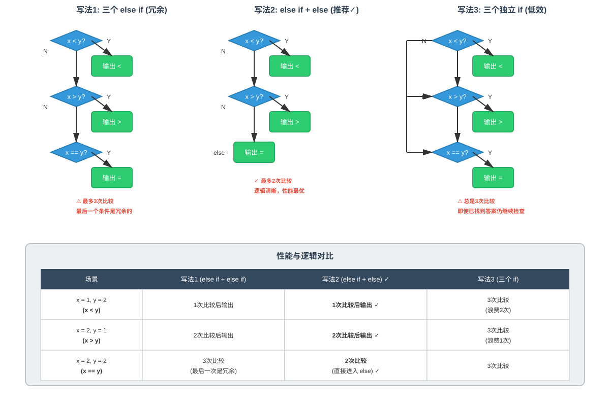

任何编程语言都包含**函数、条件语句、循环语句、变量**，这些也是构建程序的基础模块。

我们知道计算机只能理解**二进制**，我们写的是**源码**（source code），源码就是人类可以读懂的给计算机的指令列表，而计算机只能理解**机器码**（machine code），机器码是指一串只有0和1构成的代码。

因此我们需要将`源码`翻译为`机器码`，这个翻译工具称为**编译器**（compiler）。本节内容就是介绍如何将C源码翻译为机器码，另外，还将学习如何写出优秀的代码。

# CS50 的VS Code 环境  
课程提供了配置好的云环境 [cs50.dev](https://cs50.dev/)，这个环境已经配置好了该课程需要的库，可以直接使用。由于我们的目的是学习**编程**，不是配置环境，所以没必要自己折腾。比如该课程中使用的`cs50.h`等文件，如果你自己配置还需要把这些文件下载到本地。  
在继续学习之前，可以先简单了解一些会用到的Linux命令：

- `cd` - 切换目录（change directory），也就是Windows系统下的打开文件夹
- `cp` - 拷贝文件或目录（copy）
- `ls` - 列出目录下的所有文件（list）
- `mkdir` - 新建目录（make directory）
- `mv` - 移动或重命名文件或目录（move）
- `rm` - 删除文件（remove）
- `rmdir` - 删除目录（remove directory）    
# Hello World  
每个编程语言的第一个程序都是打印"Hello World!"  

这个程序用到了以下指令：

```bash
code hello.c   # code 是 VS Code 的命令行工具，用于打开或新建文件
make hello     # 编译程序，make 是构建工具，它会自动调用编译器生成可执行文件 hello
./hello        # 执行生成的可执行文件
```

**注意**：`make`不是编译器本身，而是一个**构建工具**，它会调用实际的C编译器（如`clang`或`gcc`）来完成编译工作。    
```C
// A program that says hello to the world

#include <stdio.h>

int main(void)
{
    printf("hello, world\n");
} 
```  
这个程序就是打印`hello, world`到控制台。使用的是`printf`函数，这是C的**标准输出函数**，因此需要在程序开始时将C语言中的标准输入输出头文件`stdio.h`用`#include`引入进来，这样才能使用，否则编译的时候会出现错误。你可以将`#include <stdio.h>`这行去掉，看下报错信息（提示该函数没有声明，C语言中的变量或者函数必须先声明才能使用）。

另外，注意`\n`是**换行符**（newline），意思是打印`hello, world`后换行，你也可以去掉后重新编译执行看下没有换行符的结果。

# 头文件和 CS50 的 Man 手册  
比如`hello.c`中用到的`stdio.h`就是**头文件**（header file）。这里我们可以了解**库**（library）的概念。

**库**就是你自己或者其他人写的可以使用的代码的集合。你可以在 [Man 手册](https://manual.cs50.io/) 中查看所有可能使用到的库。  
比如`cs50.h`就是该课程的制作者写的函数的集合，我们可以直接使用，如以下函数  
```
get_char
get_double
get_float
get_int
get_long
get_string
```   
我们这里使用` get_string`演示一下：  
```C
 #include <stdio.h>
 #include <cs50.h>

int main(void) {
    string answer = get_string("What's your name? \n");
    printf("Hello %s!\n", answer);
}
```  
`get_string`就是定义在`cs50.h`中的函数，如果不包含，编译时就会出现前面没有包含`stdio.h`时使用`printf`函数一样的错误。

这里还有两个重要知识点：

1. **变量**`answer`，这是一个`string`类型的变量，可以使用这个变量表示任何字符串。其它的常用类型还有`int`（整型）、`bool`（布尔型）、`char`（字符型）等等。
2. **格式占位符**`%s`，它告诉`printf`函数以字符串（string）的格式打印`answer`这个变量。  
# 类型与格式占位符  
本课程中`printf`打印时用到的标准化格式占位符有以下几种：

| 占位符 | 对应类型 | 说明 |
|--------|---------|------|
| `%c`   | char    | 字符类型 |
| `%f`   | float/double | 浮点数类型 |
| `%i`   | int     | 整型 |
| `%li`  | long    | 长整型 |
| `%s`   | string  | 字符串类型 |  
# 条件语句  
```C
// compare.c
#include <cs50.h>
#include <stdio.h>

int main(void) {
    int x = get_int("What's x? ");
    int y = get_int("What's y? ");
    if (x < y) {
        printf("x is less than y\n");
    } else {
        printf("x is not less than y\n");
    }
}

```   
上述是将条件分为两种，再细分，可以分为三种结果，代码如下  
```C
#include <cs50.h>
#include <stdio.h>

int main(void)
{
    int x = get_int("What's x? ");
    int y = get_int("What's y? ");

    if (x < y)
    {
        printf("x is less than y\n");
    }
    else if (x > y)
    {
        printf("x is greater than y\n");
    }
    else if (x == y)
    {
        printf("x is equal to y\n");
    }
}
```  
但，正常情况下，我们这样写  
```C
    if (x < y)
    {
        printf("x is less than y\n");
    }
    else if (x > y)
    {
        printf("x is greater than y\n");
    }
    else 
    {
        printf("x is equal to y\n");
    }
```  
另外，请思考，我们为什么不是如下这样写  
```C
    if (x < y)
    {
        printf("x is less than y\n");
    }
    if (x > y)
    {
        printf("x is greater than y\n");
    }
    if (x == y)
    {
        printf("x is equal to y\n");
    }
```
上述给出的三种写法有什么区别呢？

- **写法2相对于写法1**：代码略显冗余，`else if (x == y)`实际上是多余的，因为前两个条件已经覆盖了`x < y`和`x > y`的情况，最后只剩`x == y`这一种可能，因此用`else`就足够了。不过从执行效率上看，两者几乎没有区别。

- **写法3（三个独立的if）的问题**：这种写法效率最低，原因如下：
  - 即使第一个条件已经成立，程序仍会继续检查后面两个条件
  - CPU需要为3个独立的分支分别进行预测
  - 指令流水线可能因此产生更多的停顿
  - 总是要执行3次判断，而写法1和2最多执行2次判断

**最佳实践**：使用`if - else if - else`结构（写法2），这样既清晰又高效。  
# 字符类型示例：agree.c  
我们通过`agree.c`讲解下字符型的使用：

```C 
// agree.c  
#include <cs50.h>
#include <stdio.h>

int main(void)
{
    char c = get_char("Do you agree? ");

    if (c == 'y')
    {
        printf("Agreed.\n");
    }
    else if (c == 'n')
    {
        printf("Not agreed.\n");
    }
}
```  

**注意**：这里的变量`c`是`char`类型，在C语言中，字符常量要用**单引号**括起来（如`'y'`、`'n'`），而字符串要用双引号（如`"hello"`）。

这里使用`y`和`n`表示yes和no，但我们知道`Y`和`N`也可以表示。上述if分支没有包含所有情况，我们需要改进：  
```C
int main(void)
{
    char c = get_char("Do you agree? ");

    if (c == 'y')
    {
        printf("Agreed.\n");
    }
    else if (c == 'n')
    {
        printf("Not agreed.\n");
    }

    else if (c == 'Y')
    {
        printf("Agreed.\n");
    }
    else if (c == 'N')
    {
        printf("Not agreed.\n");
    }

}
```  
但是，上述代码实现冗余，优化如下：  
```C
int main(void)
{
    char c = get_char("Do you agree? ");

    if (c == 'y' || c == 'Y')
    {
        printf("Agreed.\n");
    }
    else if (c == 'n' || c == 'N')
    {
        printf("Not agreed.\n");
    }
}
```  

优化后的代码使用了**逻辑或运算符**`||`。C语言中常用的逻辑运算符有：

- `||` - 逻辑或（OR），只要有一个条件为真，整个表达式就为真
- `&&` - 逻辑与（AND），所有条件都为真，整个表达式才为真
- `!`  - 逻辑非（NOT），对条件取反  
# 循环语句  
通过`meow.c`来学习循环语句。

假设我们想要打印出三次"meow"（喵喵叫），初始代码如下：  
```C
int main(void)
{
    printf("meow\n");
    printf("meow\n");
    printf("meow\n");
}
```  

不难看出，通过三条相同的打印语句输出了三次"meow"，**代码重复**是不好的编程习惯。因此可以优化，这就引入了**循环语句**。

## while 循环

我们可以通过一个**计数器**来控制输出的次数：

```C
int main(void)
{
    int i = 3;
    while (i > 0)
    {
        printf("meow\n");
        i--;  // 等同于 i = i - 1
    }
}

```  

**注意**：上述`i--`是**递减运算符**，等同于`i = i - 1`。相应地，也有**递增运算符**`i++`，等同于`i = i + 1`。下面使用递增方式实现一遍：  
```C
int main(void)
{
    int i = 1;
    while (i <= 3)
    {
        printf("meow\n");
        i++;
    }
}
```  

## for 循环

除了`while`循环，还可以使用`for`循环。`for`循环更加简洁，特别适合需要明确循环次数的情况：

```C
int main(void)
{
    for (int i = 0; i < 3; i++)
    {
        printf("meow\n");
    }
}
```  

**for循环的结构**：`for (初始化; 条件; 更新)`
- `int i = 0` - 初始化计数器，设置`i`的初始值为0
- `i < 3` - 循环条件，当`i < 3`为真时继续循环
- `i++` - 每次循环后更新计数器

因此上述循环执行了3次（i=0, i=1, i=2）。

## 无限循环

如果想让程序无限执行呢？   
```C
#include <stdbool.h>  // 需要包含这个头文件才能使用 true
#include <stdio.h>

int main(void)
{
    while (true)
    {
        printf("meow\n");
    }
}
```

此时，程序会不停地打印"meow"。通过`Ctrl+C`（或`Control-C`）发送中断信号可以中断程序执行。

# 函数（抽象）  

我们可以把"喵喵叫"这个功能**抽象**出来实现，方便在其它地方进行调用。这种抽象实现就是**函数**（function）。  
```C
void meow(void)
{
    printf("meow\n");
}
```  
然后在`main`函数中调用这个函数，并且可以控制调用的次数实现控制喵喵叫的次数  
```C
// Abstraction

#include <stdio.h>

void meow(void);

int main(void)
{
    for (int i = 0; i < 3; i++)
    {
        meow();
    }
}

// Meow once
void meow(void)
{
    printf("meow\n");
}
```  

**重要概念**：
- `void meow(void);` 是**函数声明**（function prototype）
- 在C语言中，变量和函数必须先声明才能使用
- 如果函数定义在`main`之前，可以不需要单独声明
- 这里`meow`的定义在`main`的下方，因此必须先声明

**函数声明的格式**：`返回类型 函数名(参数类型);`
- 第一个`void`表示函数不返回任何值
- 第二个`void`表示函数不接受任何参数

## 带参数的函数

下面我们给`meow`函数添加参数，让它可以控制喵叫的次数：  
```C
void meow(int n);

int main(void)
{
    int n;
    do
    {
        n = get_int("Number: ");
    }
    while (n < 1);
    meow(n);
}

// Meow some number of times
void meow(int n)
{
    for (int i = 0; i < n; i++)
    {
        printf("meow\n");
    }
}
```

这样，用户就可以通过输入参数`n`来控制喵叫的次数，在`main`中通过`meow(n)`将用户输入的参数传递给`meow`函数。

**注意这里的问题**：喵叫次数通常应该是个正整数，为了保证用户输入的`n`是正整数，我们使用了`do-while`循环。

**do-while循环的特点**：
- `do { ... } while (条件);` 先执行一次循环体，然后检查条件
- 这里`while (n < 1);`的意思是：如果`n < 1`（输入的不是正整数），就继续循环，再次要求用户输入
- 只有当`n >= 1`时才会退出循环

但这个实现还有个小问题：没有任何提示告诉用户应该输入一个正整数，只是一直重复让用户输入数字。我们可以进一步改进： 
```C
int get_positive_int(void);
void meow(int n);

int main(void)
{
    int n = get_positive_int();
    meow(n);
}

// Get number of meows
int get_positive_int(void)
{
    int n;
    do
    {
        n = get_int("Number: ");
    }
    while (n < 1);
    return n;
}

// Meow some number of times
void meow(int n)
{
    for (int i = 0; i < n; i++)
    {
        printf("meow\n");
    }
}
```

通过创建`get_positive_int()`函数，我们将"获取正整数"这个功能抽象出来，使代码更加模块化和可复用。虽然这里对用户的提示还不够友好（真实场景中应该在用户输入不符合条件时给出明确提示），但我们学到了**函数抽象**的重要思想。

# 代码质量的三个维度  

通常从三个维度评价代码质量：

## 1. 正确性（Correctness）
这是首先要保证的。代码必须：
- 能够正确编译，没有语法错误
- 功能符合预期，没有逻辑错误
- 能够处理各种输入情况（包括边界情况）

## 2. 设计（Design）
合理的代码结构，包括：
- 将特定功能抽象为函数，提高代码的可复用性
- 避免代码重复（DRY原则：Don't Repeat Yourself）
- 选择合适的数据结构和算法

## 3. 风格（Style）
代码的美观性和一致性，包括：
- 变量命名要有意义（如`score`比`s`更清晰）
- 一致的代码格式（括号是否换行、缩进方式）
- 适当的注释
- 遵循统一的编码规范

良好的代码风格便于阅读和维护，尤其在大型项目和多人合作时更为重要。  
# Mario 砖块示例  

让我们通过一个有趣的例子来练习循环和函数：模拟马里奥游戏中的砖块。

首先在VS Code中实现`mario.c`程序，目的是打印一串问号：

```C
#include <stdio.h>

int main(void)
{
    for (int i = 0; i < 4; i++)
    {
        printf("?\n");
    }
}
```

运行后输出：
```
?
?
?
?
```

很明显，每打印一个`?`后就换行了，因为我们把`\n`写在循环里了。如果想打印4个问号后再换行，就需要把换行从循环中移出来：  
```C
int main(void)
{
    for (int i = 0; i < 4; i++)
    {
        printf("?");
    }
    printf("\n");
}
```   

输出：`????`

同样的逻辑，如同马里奥游戏中的砖块一样，程序中使用`#`代表砖块：

```C
#include <stdio.h>

int main(void)
{
    for (int i = 0; i < 4; i++)
    {
        printf("#\n");
    }
}
```  

这会输出一列砖块。如果想打印一个4×4的砖块矩阵呢？那就需要**嵌套循环**（nested loops）：  
```C
#include <stdio.h>

int main(void)
{
    for (int i = 0; i < 4; i++)      // 外层循环控制行数
    {
        for (int j = 0; j < 4; j++)  // 内层循环控制每行的列数
        {
            printf("#");
        }
        printf("\n");                 // 每行结束后换行
    }
}
```  

输出：
```
####
####
####
####
```

**嵌套循环工作原理**：
- 外层循环执行1次，内层循环完整执行4次
- 外层循环共执行4次，所以总共打印4行

## 使用常量

上述实现中，砖块的数量（4）是**硬编码**（hard-coded）的常数。我们可以定义一个**常量**，使用`const`关键字，这样代码更易维护：  
```C
#include <stdio.h>

int main(void)
{
    const int n = 4;  // 定义常量，表示砖块的行列数
    for (int i = 0; i < n; i++)
    {
        for (int j = 0; j < n; j++)
        {
            printf("#");
        }
        printf("\n");
    }
}
```  

**const关键字的作用**：
- `const int n = 4;` 声明一个常量`n`，值为4
- 常量一旦赋值就不能修改，编译器会保护它
- 使用常量的好处：如果需要修改尺寸，只需改一处即可
- 常量名通常使用大写或有意义的名字（如`SIZE`、`WIDTH`）

## 函数抽象练习

为了练习前面提到的抽象思想，我们可以把"打印一行砖块"的功能抽象出来：  
```C
void print_row(int width);

int main(void)
{
    const int n = 4;
    for (int i = 0; i < n; i++)
    {
        print_row(n);
    }
}

void print_row(int n)
{
    for (int i = 0; i < n; i++)
    {
        printf("#");
    }
    printf("\n");
}
```  

这样代码结构更清晰，`main`函数负责控制逻辑，`print_row`函数负责具体实现。

# 注释  

代码中一定要有适当的**注释**（comments），原因有：
1. **帮助他人理解**：团队合作时，其他人需要看懂你的代码
2. **帮助自己记忆**：几个月后回看自己的代码，可能已经忘记当时的思路
3. **解释复杂逻辑**：对于不够直观的代码，注释可以说明为什么这样写

C语言中的注释方式：

```C
// 这是单行注释

/*
   这是多行注释
   可以跨越多行
*/

int main(void)
{
    // 初始化变量
    int x = 5;
    
    /* 
       下面的循环打印5次"hello"
       使用for循环而不是while是为了代码更简洁
    */
    for (int i = 0; i < x; i++)
    {
        printf("hello\n");
    }
}
```

**注释的最佳实践**：
- 不要注释显而易见的代码（如`int x = 5; // 将5赋值给x`）
- 注释应该解释"为什么"而不是"是什么"
- 保持注释简洁明了  
# 更多运算符  

下面通过实现一个简单计算器来演示C语言中的算术运算符：

```C
// calculator.c
// 简单的加法计算器

#include <cs50.h>
#include <stdio.h>

int main(void)
{
    int x = get_int("x: ");
    int y = get_int("y: ");
    int z = x + y;
    printf("%i + %i = %i\n", x, y, z);
}
```

**C语言的算术运算符**：
- `+` 加法
- `-` 减法
- `*` 乘法
- `/` 除法
- `%` 取模（求余数）

**复合赋值运算符**：
- `+=` 例：`x += 5` 等同于 `x = x + 5`
- `-=` 例：`x -= 3` 等同于 `x = x - 3`
- `*=` 例：`x *= 2` 等同于 `x = x * 2`
- `/=` 例：`x /= 2` 等同于 `x = x / 2`  
## 整数溢出示例

下面是一个有趣的例子，演示不断将一个数乘以2：

```C  
#include <cs50.h>
#include <stdio.h>
#include <stdbool.h>

int main(void)
{
    int dollars = 1;
    while (true)
    {
        char c = get_char("Here's $%i. Double it and give to next person? ", dollars);
        if (c == 'y')
        {
            dollars *= 2;  // 不断乘以2
        }
        else
        {
            break;
        }
    }
    printf("Here's $%i.\n", dollars);
}
```  

当一直输入`y`，即不断乘2，最终会发现结果出现了负数甚至0，为什么呢？

# 数据类型的限制与整数溢出

## 整数的范围

C语言中不同整数类型有不同的取值范围：

| 类型 | 字节数 | 取值范围 |
|------|--------|----------|
| `char` | 1 | -128 到 127 |
| `int` | 4 | -2,147,483,648 到 2,147,483,647 |
| `unsigned int` | 4 | 0 到 4,294,967,295 |
| `long` | 8 | -9,223,372,036,854,775,808 到 9,223,372,036,854,775,807 |

**重要**：上面例子中`int`的最大值是**2,147,483,647**（2³¹-1），而不是4,294,967,295。后者是`unsigned int`（无符号整数）的最大值。

## 整数溢出（Integer Overflow）

当一个整数超过其类型能表示的最大值时，就会发生**整数溢出**：

```C
int x = 2147483647;  // int的最大值
x = x + 1;           // 溢出！结果变成 -2147483648
```

这就像汽车里程表：
- 当里程达到999999时，再加1就会变回000000
- 计算机中的整数也是这样"回绕"的

## 真实世界的影响

整数溢出在现实中可能造成严重后果：
- **波音787梦幻客机**：2015年发现，如果飞机连续通电248天，会因为计时器溢出导致发电机失效
- **游戏bug**：许多游戏中的数值异常都是整数溢出导致的
- **安全漏洞**：整数溢出可能被黑客利用来攻击系统

## 解决方案

如果需要存储更大的数，可以使用`long`类型：

```C
long dollars = 1;  // 可以存储更大的值
```

但即使是`long`也有上限，编程时要时刻注意数据范围！  
## 本课程常用的数据类型

| 类型 | 说明 | 示例 |
|------|------|------|
| `bool` | 布尔类型，只有两个值：`true`或`false` | `bool is_valid = true;` |
| `char` | 单个字符 | `char grade = 'A';` |
| `int` | 整数 | `int age = 20;` |
| `long` | 长整数，范围比int大 | `long population = 7800000000;` |
| `float` | 单精度浮点数，可表示小数 | `float pi = 3.14;` |
| `double` | 双精度浮点数，精度比float高 | `double precise_pi = 3.14159265359;` |
| `string` | 字符串（CS50库提供，本质是字符数组） | `string name = "Alice";` |  
# 整数除法与截断  

另一个需要注意的问题是**整数除法的截断**（truncation）。

```C
// 整数除法会截断小数部分

#include <cs50.h>
#include <stdio.h>

int main(void)
{
    // 获取用户输入
    int x = get_int("x: ");
    int y = get_int("y: ");

    // 两个整数相除
    printf("%i\n", x / y);
}
```  

**问题**：如果输入`x=5, y=2`，结果是`2`而不是`2.5`。

**原因**：在C语言中，**两个整数相除，结果也是整数**，小数部分会被直接舍弃（截断），而不是四舍五入。

```C
5 / 2   结果是 2（不是 2.5）
7 / 3   结果是 2（不是 2.333...）
9 / 4   结果是 2（不是 2.25）
```

## 解决方案：使用浮点数

如果想得到精确的小数结果，可以使用`float`或`double`类型：  
```C
// 使用浮点数进行除法

#include <cs50.h>
#include <stdio.h>

int main(void)
{
    // 获取用户输入（浮点数）
    float x = get_float("x: ");
    float y = get_float("y: ");

    // 除法运算
    printf("%.2f\n", x / y);      // 保留2位小数
    printf("%.50f\n", x / y);     // 保留50位小数，观察精度问题
}
```  

**注意格式占位符**：`%.2f`表示保留2位小数，`%.50f`表示保留50位小数。

## 浮点数精度问题

当你运行上述程序并输入`x=1, y=3`时，会看到类似这样的输出：

```
0.33
0.33333334326744079589843750000000000000000000000000
```

奇怪的是，1÷3应该是0.333333...（无限循环），但计算机给出的结果在某个位置后就不准确了。

**原因**：这是**浮点数精度限制**（floating-point imprecision）。
- 计算机使用二进制存储浮点数
- 有些十进制小数无法精确地用二进制表示
- `float`只有32位，精度约6-7位有效数字
- `double`有64位，精度约15-16位有效数字

**重要提示**：
- 浮点数的不精确表明计算机计算数字的精确度是有限的
- 在编码时，请特别注意所使用的变量类型
- 避免用`==`直接比较两个浮点数是否相等
- 金融计算等对精度要求高的场景，不应直接使用浮点数

**真实案例**：
- 1991年海湾战争，美军爱国者导弹因浮点数误差未能拦截伊拉克导弹，导致28人死亡
- 1996年阿丽亚娜5号火箭，因数值转换溢出，发射37秒后爆炸  
# 总结  

在本课中，我们学习了如何将Scratch中的编程概念应用到C语言中。主要内容包括：

## 核心知识点

1. **C语言基础**
   - 如何编写和编译第一个C程序
   - 理解源码到机器码的编译过程
   - 使用Linux命令行操作文件

2. **数据类型**
   - 基本数据类型：`int`、`float`、`char`、`bool`、`string`等
   - 格式占位符：`%i`、`%f`、`%c`、`%s`等
   - 整数溢出和浮点数精度问题

3. **程序结构**
   - 条件语句：`if`、`else if`、`else`
   - 循环语句：`while`、`for`、`do-while`
   - 逻辑运算符：`&&`、`||`、`!`

4. **函数与抽象**
   - 如何定义和声明函数
   - 函数的参数和返回值
   - 通过函数实现代码的模块化和复用

5. **编程最佳实践**
   - 代码质量的三个维度：正确性、设计、风格
   - 合理使用注释
   - 避免代码重复
   - 使用有意义的变量名

## 重要概念

- **头文件和库**：`#include <stdio.h>`、`#include <cs50.h>`
- **常量**：使用`const`关键字定义不可修改的值
- **类型限制**：理解不同数据类型的取值范围
- **整数截断**：整数除法会丢弃小数部分

## 实践项目

通过Mario砖块等例子，练习了：
- 嵌套循环的使用
- 将功能抽象为函数
- 使用常量提高代码可维护性

下节课我们将学习**数组**，它是C语言中组织和管理数据的重要工具。

---

**参考资料**：
- [CS50 Week 1 官方笔记](https://cs50.harvard.edu/x/notes/1/)
- [CS50 Manual Pages](https://manual.cs50.io/)


